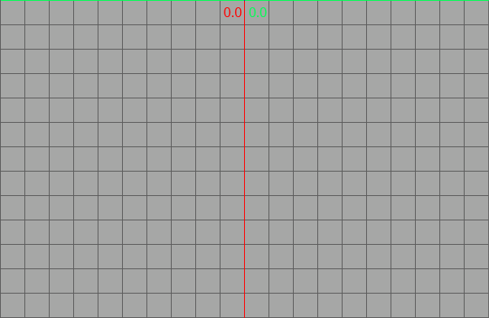

# Camera 2D
## Orthographic
### Bottom left


Entities created with the default `Transform` component (0.0, 0.0, 0.0) will be at bottom left corner of the screen with this camera setup.

```rust
// Get screen width and height
let (width, height) = {
    let dim = world.read_resource::<ScreenDimensions>();
    (dim.width(), dim.height())
};
// Set the transform for the camera
// transform defaults are (x: 0.0, y: 0.0, z: 0.0)
let mut transform = Transform::default();
// Set the Z-axis to 10.0 which should be enough for most 2d games.
transform.set_z(10.0);
// Create the camera entity
world
    .create_entity()
    .with(transform)
    .with(Camera::from(Projection::orthographic(
        0.0,
        width,
        0.0,
        height,
    )))
    .build();
```

### Bottom middle


Entities created with the default `Transform` component (0.0, 0.0, 0.0) will be at bottom middle of the screen with this camera setup.

```rust
// Get screen width and height
let (width, height) = {
    let dim = world.read_resource::<ScreenDimensions>();
    (dim.width(), dim.height())
};
// Set the transform for the camera
// transform defaults are (x: 0.0, y: 0.0, z: 0.0)
let mut transform = Transform::default();
// Set the Z-axis to 10.0 which should be enough for most 2d games.
transform.set_z(10.0);
// Create the camera entity
world
    .create_entity()
    .with(transform)
    .with(Camera::from(Projection::orthographic(
        -width/2.0,
        width/2.0,
        0.0,
        height,
    )))
    .build();
```

### Center middle


Entities created with the default `Transform` component (0.0, 0.0, 0.0) will be at center of the screen with this camera setup.

```rust
// Get screen width and height
let (width, height) = {
    let dim = world.read_resource::<ScreenDimensions>();
    (dim.width(), dim.height())
};
// Set the transform for the camera
// transform defaults are (x: 0.0, y: 0.0, z: 0.0)
let mut transform = Transform::default();
// Set the Z-axis to 10.0 which should be enough for most 2d games.
transform.set_z(10.0);
// Create the camera entity
world
    .create_entity()
    .with(transform)
    .with(Camera::from(Projection::orthographic(
        -width/2.0,
        width/2.0,
        -height/2.0,
        height/2.0,
    )))
    .build();
```

### Top middle


Entities created with the default `Transform` component (0.0, 0.0, 0.0) will be at top middle of the screen with this camera setup.

```rust
// Get screen width and height
let (width, height) = {
    let dim = world.read_resource::<ScreenDimensions>();
    (dim.width(), dim.height())
};
// Set the transform for the camera
// transform defaults are (x: 0.0, y: 0.0, z: 0.0)
let mut transform = Transform::default();
// Set the Z-axis to 10.0 which should be enough for most 2d games.
transform.set_z(10.0);
// Create the camera entity
world
    .create_entity()
    .with(transform)
    .with(Camera::from(Projection::orthographic(
        -width/2.0,
        width/2.0,
        0.0,
        -height,
    )))
    .build();
```
